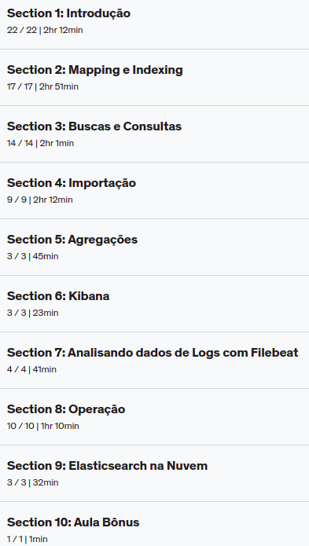

#  Elasticsearch e Elastic Stack

  - Host free Elasticsearch: [Searchly](http://www.searchly.com/) -> [Doc](http://www.searchly.com/docs/intro)
  
  - [Elasticsearch, Logstash e Kibana (Pilha ELK)](https://www.citic.unicamp.br/sites/default/files/arquivos/Apresenta%C3%A7%C3%A3o%20ELK_IB_Unicamp_Evolvo_final_v5.pdf)
  
  - [MovieLens](https://movielens.org/)
  
  - [GroupLens](https://grouplens.org/datasets/movielens/)
  
  - [unix time stamp](https://www.unixtimestamp.com/)
  
  - [Como instalar o Elasticsearch, Logstash e Kibana (Pilha Elastic) no Ubuntu 20.04](https://www.digitalocean.com/community/tutorials/how-to-install-elasticsearch-logstash-and-kibana-elastic-stack-on-ubuntu-20-04-pt)
  
  - Conteúdo:
  
  
  
  
## Referência

  - [Material do curso - site prof Fernando Amaral](https://www.eia.ai/material_download)
  
    - [Elasticsearch](https://1drv.ms/u/s!Am4PqLFJZ2-ai6cDMus5zXtIeCsuQQ?e=GcrANZ)